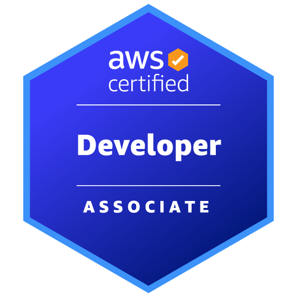

<h1 align="center">Thomas Boyle</h1>

  Software Engineer &nbsp;·&nbsp; Cloud &nbsp;·&nbsp; Data Engineering &nbsp;·&nbsp; Costa Rica 🇨🇷

  <a href="https://boyledalorzo.com">boyledalorzo.com</a>

---

**Who I am**

Software Engineer with relentless standards for quality and delivery. I build tools, pipelines, and systems that are meant to last — from terminal utilities to cloud-scale data infrastructure.

Currently deep in **Data Engineering** and **AI Agent Orchestration**, with a strong foundation in AWS, Spark, and Kubernetes.

- 🌱 &nbsp;Working toward Databricks Certified Data Engineer Associate
- 💬 &nbsp;Ask me about AWS, Terraform, Spark, or building CLI tools in Python
- 🔗 &nbsp;[boyledalorzo.com](https://boyledalorzo.com)

 

---

## Certifications 🏆

  &nbsp;&nbsp;&nbsp;&nbsp;
  &nbsp;&nbsp;&nbsp;&nbsp;
  &nbsp;&nbsp;&nbsp;&nbsp;
  

---

**🛠 &nbsp;Stack**

Languages:&nbsp;
&nbsp;
&nbsp;
&nbsp;
&nbsp;
&nbsp;
&nbsp; 
Data & AI:&nbsp;
&nbsp;
&nbsp;
&nbsp;
&nbsp;
&nbsp;
&nbsp; 
Cloud & Infra:&nbsp;
&nbsp;
&nbsp;
&nbsp;
&nbsp;

---

  
<b>📦 &nbsp;Projects</b>
 

  ✦ &nbsp;[**pingx**](https://github.com/Tom-xyz/pingx) — full-screen terminal ping monitor with WAN failover detection 
  ✦ &nbsp;[**PyJig**](https://github.com/Tom-xyz/PyJig) — Python jigsaw puzzle image matching solver 
  ✦ &nbsp;[**MicroLink**](https://github.com/Tom-xyz/MicroLink) — lightweight URL shortener service 
  ✦ &nbsp;[**3DSimpleTurntable**](https://github.com/Tom-xyz/3DSimpleTurntable) — 3D model turntable viewer 

  &nbsp;&nbsp;
  

